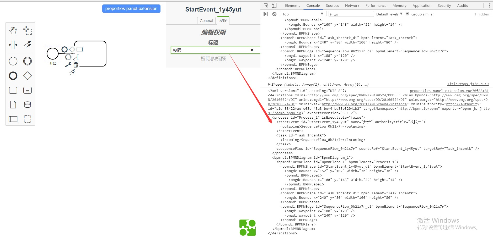

# Bpmn-vue-properties-panel

## 项目描述

此项目为以下教材中的教材案例.

- [《properties篇》](https://github.com/LinDaiDai/bpmn-chinese-document/tree/master/LinDaiDai/全网最详bpmn.js教材-properties篇.md)🔥🔥🔥

- [《properties-panel篇(上)》](https://github.com/LinDaiDai/bpmn-chinese-document/tree/master/LinDaiDai/全网最详bpmn.js教材-properties-panel篇(上).md)🔥🔥🔥

- [《properties-panel篇(下)》](https://github.com/LinDaiDai/bpmn-chinese-document/tree/master/LinDaiDai/全网最详bpmn.js教材-properties-panel篇(下).md)🔥🔥🔥

- [《Color篇》](https://github.com/LinDaiDai/bpmn-chinese-document/tree/master/LinDaiDai/全网最详bpmn.js教材-Color篇.md)🔥🔥🔥


## 项目截图:




## 如何使用

将项目克隆至本地:

```
git clone git@github.com:LinDaiDai/bpmn-vue-properties-panel.git
```

安装依赖:

```
npm install
```

本地启动项目:

```
npm run serve
```

打包发布至生成环境:

```
npm run build
```

